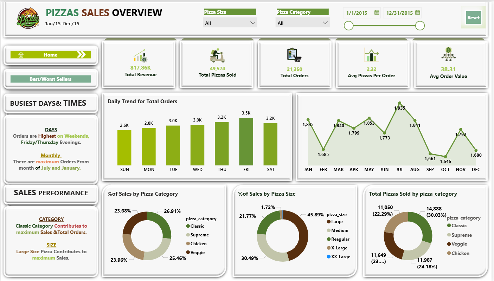

#  Pizza Sales Analysis Dashboard (Power BI)

## 📊 Project Overview
This project provides a comprehensive analysis of pizza sales data for **Pickle Pizza** over the year 2015. The goal is to identify sales trends, customer preferences, and product performance to drive data-driven business decisions.

## 🚀 Key Features
The report consists of two main dashboards:
1. **Sales Overview:** High-level KPIs including total revenue, order trends (daily/monthly), and sales distribution by category and size.
2. **Product Performance:** Detailed analysis of the Top 5 and Bottom 5 pizzas based on Revenue, Quantity, and Total Orders.

## 📈 Executive Summary
* **Total Revenue:** $817.86K
* **Total Pizzas Sold:** 49,574
* **Total Orders:** 21,350
* **Average Order Value:** $38.31
* **Busiest Periods:** Weekends (Friday/Saturday) and the months of July and January.
* **Top Performer:** "The Thai Chicken Pizza" (Highest Revenue).
* **Most Popular Size:** Large (contributing ~45.9% of sales).

## 🛠️ Tools Used
* **Power BI Desktop:** For data modeling and visualization.
* **Power Query:** For data cleaning and transformation.
* **DAX (Data Analysis Expressions):** For creating calculated measures and KPIs.
 ---
  ## 🎥 Project Video Demo
https://github.com/user-attachments/assets/4e0909bd-a97c-4a22-a7a3-bfffff340193
---
## 🖼️ Screenshots
### 1. Sales Overview

### 2. Product Performance

## 📝 How to Use
1. Download the `.pbix` file from this repository.
2. Open it using **Power BI Desktop**.
3. Use the slicers (Pizza Size, Category, Date Range) to filter the data.

---
**Developed by:** Eng. Mohamed Edris
